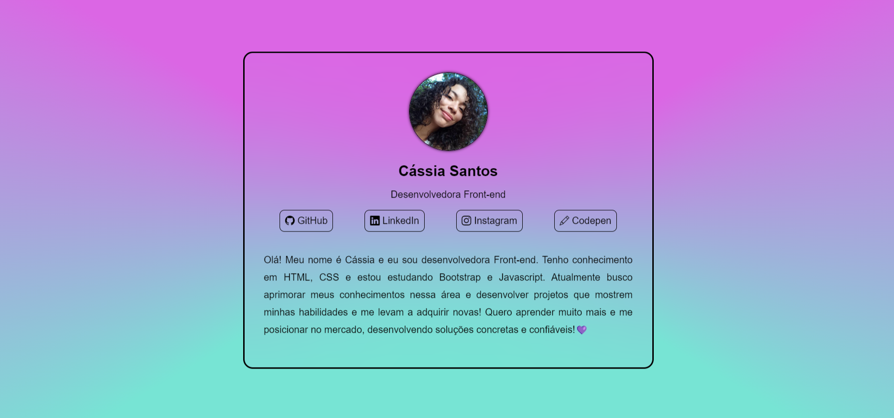
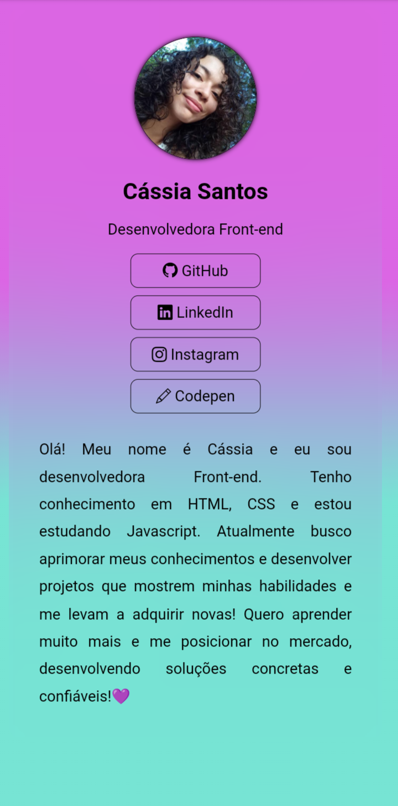

# Cartao de visita de Cássia Santos

Esse projeto  é um cartão de visita meu construído com HMTL, CSS e Javascript durante uma masterclass de Javascript da escola PrograMaria, ensinado por Natália F. Silva, desenvolvedora front-end. Nesse projeto, pude aprender formas de inserir conteúdo na página HTML pelo Javascript e propriedades de CSS que não conhecia. Achei muito divertido criar esse projeto e usei alguns conhecimentos de responsividade para adaptá-lo para telas menores. Você pode ter uma prévia do projeto na foto abaixo:

### Versão desktop:

### Versão mobile:

 ###### contato: cassia.oliveira.profissional@gmail.com
